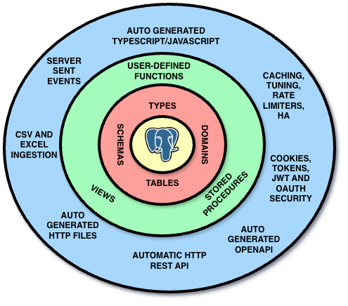

# NpgsqlRest

[](https://github.com/NpgsqlRest/NpgsqlRest/actions/workflows/build-test-publish.yml)


**Automatic REST API Server for PostgreSQL** | [6.1x faster than PostgREST](https://npgsqlrest.github.io/blog/postgresql-rest-api-benchmark-2026.html)

> Turn SQL files and PostgreSQL objects into a production-ready REST API server with automatic TypeScript code generation and end-to-end type safety.

<p align="center">
  
</p>

**[Documentation](https://npgsqlrest.github.io/)** | **[Getting Started](https://npgsqlrest.github.io/getting-started/)** | **[Configuration Reference](https://npgsqlrest.github.io/config-reference/)** | **[Annotation Guide](https://npgsqlrest.github.io/comment-annotations/)**

## From SQL to REST API in Seconds

Write a SQL file:

```sql
-- sql/process_order.sql
-- HTTP POST
-- @authorize admin
-- @result1 validate
-- @result3 confirm
-- @param $1 order_id
select count(*) as found from orders where id = $1;
update orders set status = 'processing' where id = $1;
select id, status from orders where id = $1;
```

Get a fully configured REST endpoint: `POST /api/process-order`

```json
{"validate": [{"found": 1}], "result2": 1, "confirm": [{"id": 42, "status": "processing"}]}
```

With auto-generated TypeScript client:

```typescript
export async function processOrder(orderid: number) : Promise<{
    validate: { found: number }[],
    result2: number,
    confirm: { id: number, status: string }[]
}> {
    const response = await fetch(baseUrl + "/api/process-order", {
        method: "POST",
        headers: { "Content-Type": "application/json" },
        body: JSON.stringify({ orderid }),
    });
    return await response.json();
}
```

No framework, no ORM, no boilerplate. Authorization, parameter inference, and type safety — all from a SQL file.

## Endpoint Sources

NpgsqlRest generates REST endpoints from multiple sources. Use whichever fits your use case — or combine them:

| Source | Strengths | Example |
|--------|-----------|---------|
| **SQL Files** | Easy to manage, convenient, no database deployment needed, multi-command batch scripts | `sql/get_users.sql` → `GET /api/get-users` |
| **Functions & Procedures** | True static type checking end-to-end, reusable business logic, full power of PL/pgSQL or any other PostgreSQL language | `get_user_by_id(int)` → `GET /api/get-user-by-id` |
| **Tables & Views** | Automatic CRUD operations for standard REST resources | `users` table → `GET/POST/PUT/DELETE /api/users` |

SQL files and functions/procedures are the primary sources — each with distinct advantages. SQL files are easier to manage and version alongside your application code. Functions and procedures offer full PostgreSQL type checking and the power of PL/pgSQL. Use both together for the best of both worlds.

All sources share the same annotation system — `@authorize`, `@param`, `@cached`, `@path`, and 50+ other annotations work everywhere.

## Key Features

- **SQL Files as Endpoints** — Drop a `.sql` file in a folder and get a REST endpoint. Single or multi-command scripts, with automatic HTTP verb detection, parameter inference, and full annotation support
- **Multi-Command Scripts** — SQL files with multiple statements execute as a batch via `NpgsqlBatch`, returning a JSON object with named result sets. Void commands return rows-affected count
- **Instant API from Database Objects** — Automatically creates REST endpoints from PostgreSQL functions, procedures, tables, and views
- **Declarative Configuration** — Configure endpoints using SQL comment annotations — same syntax works in both SQL files and database object comments
- **Code Generation** — Auto-generate frontend TypeScript/JavaScript code and .http files for testing. End-to-end type safety from PostgreSQL to your frontend
- **High Performance** — [6.1x faster than PostgREST](https://npgsqlrest.github.io/blog/postgresql-rest-api-benchmark-2026.html) at 100 concurrent users with low latency and high throughput
- **Native Executables** — AOT-compiled binaries with zero dependencies and instant startup
- **Enterprise Ready** — Authentication, authorization, rate limiting, caching, SSE streaming, encryption, OpenAPI 3.0, and more

## PostgreSQL at the Center

PostgreSQL is not just storage. It's a powerful computation engine with transactions, constraints, triggers, functions, and decades of optimization. NpgsqlRest puts PostgreSQL at the center and generates everything else:

- **SQL files as endpoints** — Write a `.sql` file, get a REST endpoint. No functions needed for simple queries
- **Schema as contract** — Your tables, views, and functions become REST endpoints. One source of truth, zero drift
- **SQL comments as config** — Routes, auth rules, caching — all declared where the logic lives
- **Types flow outward** — PostgreSQL types generate TypeScript clients automatically. No manual mappings
- **No middle tier** — No ORM impedance mismatch, no N+1 queries, no controller boilerplate

## Enterprise Features

NpgsqlRest includes a comprehensive set of enterprise-grade features, all configurable through SQL comment annotations:

- **Authentication & Authorization** — Cookie auth, Basic auth, JWT-compatible claims, role-based access control, `@authorize`, `@allow_anonymous`
- **Security** — Column-level encryption/decryption, security-sensitive endpoints, IP address parameter binding
- **Caching** — Response caching with configurable expiration, per-endpoint cache control
- **Rate Limiting** — Configurable rate limiter policies per endpoint
- **Server-Sent Events (SSE)** — Real-time streaming via `RAISE INFO/NOTICE`, scoped to matching or authorized clients
- **File Uploads** — Large object and file system upload handlers with MIME type filtering
- **Reverse Proxy** — Forward requests to upstream services with passthrough or transform modes
- **HTTP Custom Types** — PostgreSQL functions can call external HTTP APIs via annotated composite types
- **OpenAPI 3.0** — Auto-generated API documentation
- **Table Format Handlers** — Pluggable response renderers (Excel, CSV, custom formats)
- **50+ Comment Annotations** — Declarative endpoint configuration covering every aspect of API behavior

For complete documentation, visit **[npgsqlrest.github.io](https://npgsqlrest.github.io/)**

### How Does NpgsqlRest Compare?

See the detailed comparison: **[NpgsqlRest vs PostgREST vs Supabase](https://npgsqlrest.github.io/blog/npgsqlrest-vs-postgrest-supabase-comparison.html)**

## Installation

| Method | Command |
|--------|---------|
| **NPM** | `npm i npgsqlrest` |
| **Docker** | `docker pull vbilopav/npgsqlrest:latest` |
| **Direct Download** | [Releases](https://github.com/NpgsqlRest/NpgsqlRest/releases) |
| **.NET Library** | `dotnet add package NpgsqlRest` |

## Requirements

- PostgreSQL >= 13
- No runtime dependencies for native executables

## Documentation

For complete documentation including configuration options, authentication setup, TypeScript generation, and more, visit **[npgsqlrest.github.io](https://npgsqlrest.github.io/)**

## Contributing

Contributions are welcome. Please open a pull request with a description of your changes.

## License

MIT License
